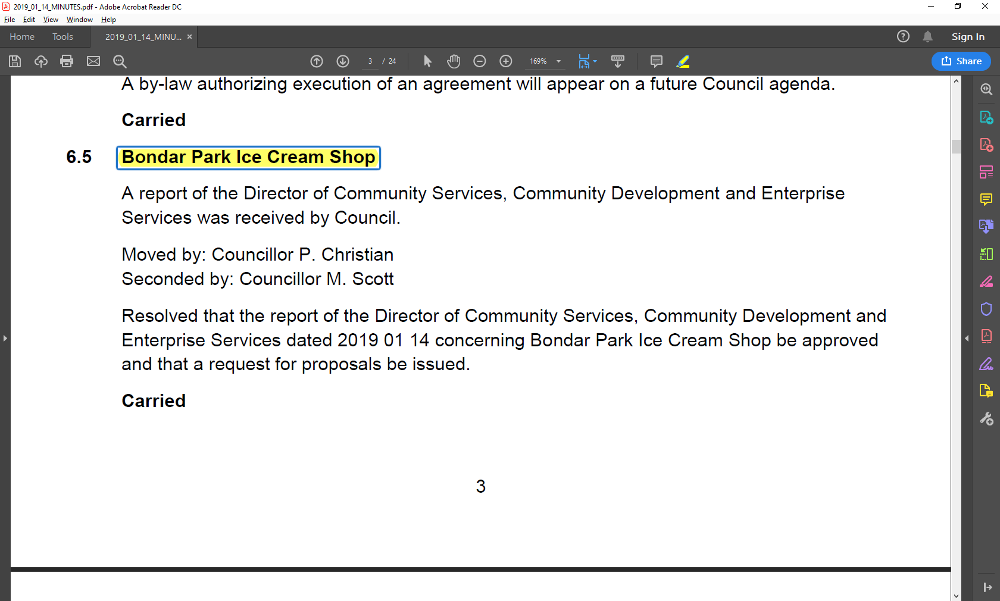
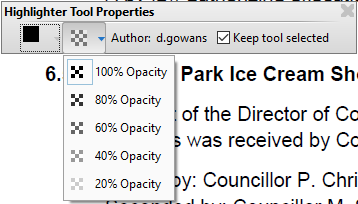
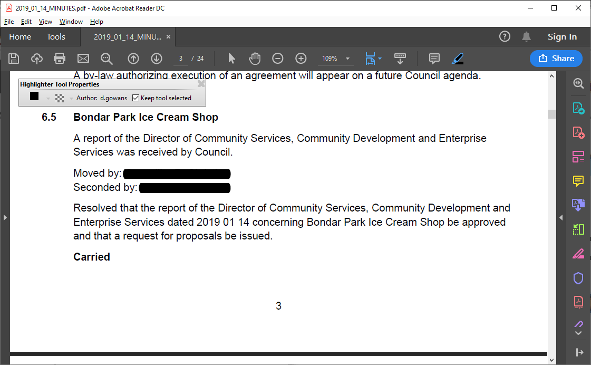
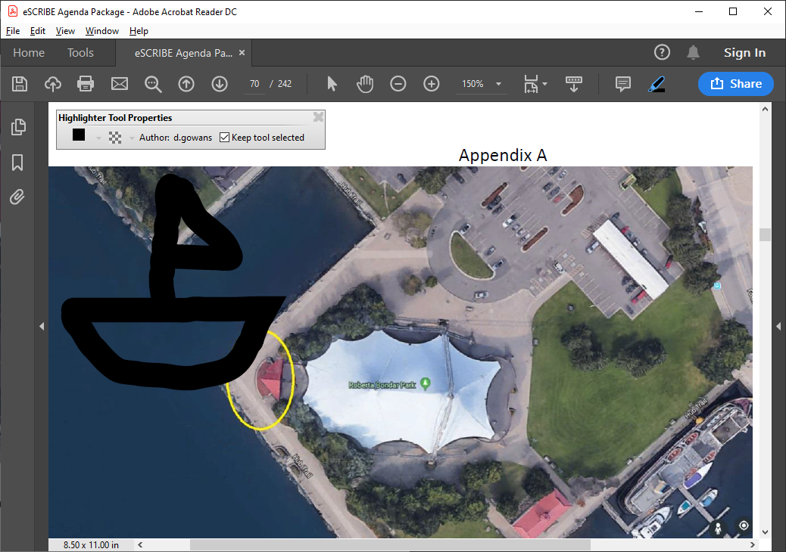

# How To Redact Text in Adobe Acrobat Reader for Free

Adobe Acrobat Reader offers tools to highlight text and images for free.
The default settings are yellow with opacity.

**But what if we use a black "highlighter" with 100% opacity?**

Right click the toolbar, and select "Show Properties Bar".

If the area you are redacting is text, you simply need to highlight the text.

If the area you are redacting is part of an image, the highlighter will
act more like a marker.

Acrobat will warn you that highlighting in black is not a true redaction.
That's what this [PDF Flattener tool](https://github.com/cityssm/pdfFlattener) is for!
Save your highlighted document, then flatten it!
